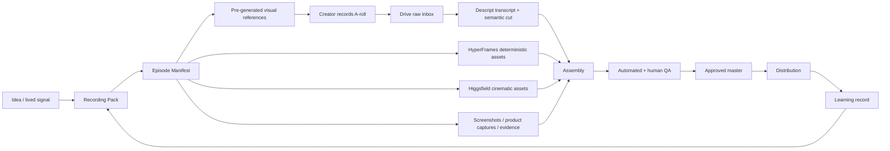

# CIS Video Production OS

> **Status:** Canonical production strategy · 2026-09-03  
> **North star:** the creator supplies signal, performance, and taste; the system supplies the production company.

This document defines the default video-production architecture for FrankX / GenCreator and any CIS implementation that wants high-quality human-led short-form or long-form video without building a traditional editing team.

## 1. Decision

The production system is **manifest-first, visual-first, and agent-orchestrated**.

The human should normally do only four things:

1. originate the idea or lived signal;
2. approve the recording pack;
3. perform on camera;
4. approve or reject the final render.

Everything repeatable after that should become software, a deterministic renderer, or a specialist generation adapter.

### Non-negotiables

- Raw multi-GB video does **not** become LLM context. Store it in media infrastructure and reason over transcripts, scene summaries, manifests, hashes, and asset references.
- The same visual object should move from **storyboard → recording reference → edit asset → published artifact**. Do not make the performer imagine what an editor may add later.
- Use deterministic rendering for typography, diagrams, charts, UI frames, captions, brand motion, transitions, and repeatable layouts.
- Use generative video for imagery that is expensive or impossible to film, not as a substitute for the creator's point of view.
- Human editors are an exception path, not the default architecture.
- Every finished piece should feed a learning record: hook, format, visual treatment, CTA, outcome, and the next change.

## 2. Canonical tool routing

| Job | Default | Why | Secondary / escalation |
| --- | --- | --- | --- |
| Founder/mobile capture | DJI Pocket-class camera + DJI Mic, local 4K | maximum capture frequency, excellent mobile/studio overlap | Sony studio body only after volume proves the upgrade |
| Remote interview / guest capture | Riverside | isolated remote tracks, browser capture, screen share | local recorder when remote features are irrelevant |
| Raw media ingress | Google Drive | frictionless phone/camera upload; durable working inbox | R2 mirror later for machine/public asset access |
| Transcript + semantic A-roll edit | **Descript** | transcript-native take selection, dead-air removal, narrative edit, connected agent surface | NLE/human editor only for exceptional craft requirements |
| Deterministic motion graphics + agent-authored video | **HyperFrames** | HTML-native, agent-first skills, deterministic frame seeking, CI/Lambda rendering, Apache-2.0 | Remotion for existing React compositions or React-first application surfaces |
| Cinematic/generated B-roll | **Higgsfield** | model routing, social/cinematic generation, references/elements, batch generation | provider-specific models when a particular model materially wins |
| Fully synthetic storyboard-to-video | Hypernatural, optional | useful MCP/chat-native synthetic lane with shot editing and reusable ingredients | not the default for FrankX talking-head content |
| Brand system / source design | Figma + Canva | define reusable design language and reference assets | never use either as the recurring timeline/assembly bottleneck |
| Human review/versioning | Descript review initially | one review surface, no extra ops | Frame.io when multiple external humans create annotation/versioning pressure |
| Workflow automation | n8n | durable triggers, webhooks, queues, scheduled orchestration | application-native jobs for product-critical paths |
| Human operating cockpit | Notion | readable strategy, pipeline, decisions, review queue | not canonical code/protocol storage |
| Technical source of truth | GitHub: CIS + GenCreator Studio | versioned architecture, skills, schemas, adapters, UI | no duplicate technical canon in Notion |

### HyperFrames is now the default deterministic renderer

CIS previously treated Remotion and HyperFrames as peers. For **new agent-authored video work**, use HyperFrames first.

Reasons:

- agents already generate HTML/CSS/JS extremely well;
- compositions are editable source projects rather than flattened timeline state;
- frame seeking makes automated rendering and regression testing deterministic;
- its skill system is built explicitly for agent production;
- it can use GSAP, CSS, Lottie, Three.js, Anime.js, WAAPI, charts, captions, overlays, and ordinary web components;
- Apache-2.0 is cleaner for an open, redistributable CIS reference stack.

Keep Remotion as a **compatibility and specialist adapter**. Do not delete existing Remotion work. Migrate only when there is a real maintenance or licensing benefit.

Recommended agent setup:

```bash
npx hyperframes skills update
```

Use the `/hyperframes` router before authoring a composition. For a mature FrankX visual language, maintain a project-level `frame.md`/design contract so agents render from the same typography, spacing, motion, caption, chart, and transition grammar every time.

## 3. End-to-end architecture



The key property is **parallelism**. The creator should not finish recording and then wait for a production team to begin thinking.

### Before recording

The system creates:

- research/evidence packet;
- 3–5 hook candidates;
- selected script or beat sheet;
- actual draft diagrams / graphics / reference imagery;
- performance and gesture cues;
- episode manifest;
- initial generated B-roll jobs where the script is stable.

### During recording

The Recording Console displays one beat at a time:

- spoken line / thought;
- actual visual preview;
- delivery cue;
- framing / gesture cue;
- next beat.

A visual shown during recording keeps the same `asset_id` in the final edit.

### While the raw file uploads and transcribes

Run in parallel:

- remaining Higgsfield generations;
- HyperFrames compositions and renders;
- screenshots / UI captures;
- fact/source verification;
- thumbnail / cover variants;
- platform copy drafts.

### After transcription

Reconcile the *actual performance* against the planned manifest. Only regenerate visual assets for meaningful deltas.

## 4. Episode manifest

The manifest is the intelligence layer. Media is referenced, not embedded.

```yaml
episode_id: fx-2026-09-003
brand: frankx
format: founder-short
aspect_ratio: 9:16
status: recorded
source_media:
  drive_url: https://drive.google.com/...
  transcript_ref: descript://...
beats:
  - id: b01
    intent: hook
    spoken: "Most AI businesses are building the wrong layer."
    visual:
      asset_id: v01
      kind: hyperframes
      role: architecture-reveal
      duration_s: 2.4
    performance:
      cue: "hold eye contact; half-beat before wrong layer"
  - id: b02
    intent: proof
    spoken: "Look at where the state actually lives."
    visual:
      asset_id: v02
      kind: screen-capture
      role: evidence
assets:
  v01:
    status: ready
    source: hyperframes
    uri: asset://v01.mp4
  v02:
    status: ready
    source: capture
    uri: asset://v02.mp4
qa:
  factual: pending
  brand: pending
  retention: pending
  rights: pending
```

This should map into CIP `Brief` and `AssetBundle` rather than creating a parallel content protocol. Treat the video manifest as a production view over CIP.

## 5. Operator commands

The creator-facing interface should collapse to a handful of verbs.

### `PACK <idea>`

Research, choose the angle, write the recording pack, generate the episode manifest, and prepare the visual references.

### `CUT LATEST`

Locate the newest approved raw recording, import/reference it in Descript, transcribe, select the strongest takes, remove dead space and repeated attempts, reconcile the transcript to the manifest, and create the first review composition.

### `RENDER MISSING`

Generate only unresolved deterministic graphics, screenshots, diagrams, cinematic B-roll, or captions. Do not regenerate accepted assets.

### `REVIEW`

Run factual, voice, visual, audio, rights, retention, and platform-safe-area QA. Return only material defects and a recommended decision.

### `SHIP`

Render the approved master, create platform variants/copy, publish through approved distribution adapters, and record the attestation.

### `LEARN`

Attach performance outcomes to hook, format, visual grammar, CTA, and topic. Promote only repeatable winning patterns into the next recording pack.

## 6. Descript cost / agent-call discipline

Treat Descript as a **semantic timeline assembler**, not the creative brain.

Prefer:

1. one import/transcription operation;
2. one comprehensive edit instruction containing the full cut plan and known asset map;
3. one revision instruction after review.

Avoid dozens of micro-agent calls such as "trim this", "move this", "change caption" one at a time.

Create visuals outside Descript whenever they need deterministic design control. Hand Descript assets with explicit IDs and insertion intent.

## 7. Visual routing rules

Route by visual job, not by favorite tool.

### HyperFrames

Use for:

- architecture diagrams;
- animated charts and evidence graphics;
- kinetic typography;
- captions and highlights;
- title cards / chapter cards;
- UI and website walkthrough composites;
- branded lower thirds and callouts;
- reusable transitions;
- screen-with-presenter layouts;
- deterministic template families.

### Higgsfield

Use for:

- impossible locations;
- cinematic metaphors;
- worldbuilding imagery;
- visual hooks that require motion rather than explanation;
- product/character/reference-consistent generated scenes;
- short B-roll inserts where real filming has poor ROI.

### Real capture / screen capture

Prefer real evidence whenever the claim concerns something that actually exists: a product, repository, dashboard, result, place, prototype, or experiment.

### Hypernatural

Use as an optional fast lane for:

- faceless explainers;
- fully synthetic campaigns;
- storyboard-led experiments where speed matters more than preserving a human performance;
- alternate brand channels that do not require the founder on camera.

Do **not** make it the default A-roll editor for founder content; that would duplicate Descript + Higgsfield + HyperFrames while giving up some control over the final grammar.

## 8. Recording Console requirements

The private GenCreator Studio surface should support:

- one-beat-at-a-time script mode;
- visual preview next to the line;
- keyboard/remote next/previous;
- take marker / favorite take;
- framing and gesture cues;
- safe-area overlay for 9:16;
- optional mirrored teleprompter mode;
- actual asset IDs visible to the system, hidden from normal creator view;
- automatic episode state: `packed → recording → uploaded → editing → review → approved → published`;
- a "spontaneous" mode with no script that creates the manifest after transcription.

Voice-driven auto-advance is a later optimization. Do not block v1 on it.

## 9. QA gates

A piece does not ship because it is technically rendered. It ships when it clears these gates:

1. **Signal:** one sharp idea; no filler introduced by the system.
2. **Truth:** claims and screenshots match reality; speculation is labeled.
3. **Hook:** first seconds create a specific unanswered tension.
4. **Pacing:** visual state changes only when they add information or reset attention; no random motion.
5. **Evidence:** real UI/data/proof beats decorative B-roll when evidence exists.
6. **Brand:** typography, motion, captions, transitions, and color obey the active design contract.
7. **Humanity:** the founder still sounds like the founder; generated language does not flatten idiosyncrasy.
8. **Rights:** generated and sourced media have known provenance and permitted use.
9. **Platform:** safe areas, aspect ratio, captions, thumbnail/cover, and encoding are correct.
10. **Learning:** hook/format/assets/CTA are identifiable so outcomes can improve future packs.

## 10. Human staffing rule

Do not hire a traditional editor to compensate for an unfinished system.

Add an **in-person capture/operator** when physical production friction is the bottleneck: setup, second angles, events, continuity, lighting, file ingest.

Add a **VA/operator** when repetitive exception handling remains above roughly 3–5 hours/week after automation: publishing edge cases, outreach, asset chasing, moderation, partner coordination.

Add a specialist editor only when a proven content format earns enough to justify craft beyond the deterministic + generative stack.

## 11. Ownership boundaries

- **creator-intelligence-system:** protocol, production doctrine, manifests, adapter contracts, skills, prompts, learning semantics.
- **GenCreator-Studio:** Recording Console, review queue, gallery, control surfaces, adapter UX.
- **gencreator.ai:** commercial product/site/application experience; consume CIS rather than fork its protocol.
- **Notion:** human-readable cockpit, campaigns, pipeline, decisions, operator manual.
- **Google Drive:** working raw media ingress and creator archive.
- **R2:** later machine/public asset mirror, CDN origin, render artifacts where useful.
- **Descript/Higgsfield/HyperFrames:** replaceable production adapters, never the system of record.

## 12. Implementation order

### P0 — operating contract

- [x] Canonical production doctrine
- [ ] Video-director agent skill
- [ ] Recording / cut / review prompt pack

### P1 — Recording Console

- [ ] private `/studio/record` surface in GenCreator Studio
- [ ] episode manifest creation + storage
- [ ] visual preview / beat navigator
- [ ] spontaneous mode

### P2 — one-drop ingest

- [ ] Drive raw-inbox watcher
- [ ] newest-media resolver
- [ ] Descript project import + transcript reference
- [ ] idempotent episode state transitions

### P3 — deterministic visual factory

- [ ] HyperFrames installed as default renderer
- [ ] FrankX `frame.md` / motion design contract
- [ ] reusable 9:16 presenter + visual layouts
- [ ] diagrams, charts, captions, browser/UI, evidence cards
- [ ] CI render / lint / visual regression path

### P4 — generative + distribution parallelism

- [ ] Higgsfield batch adapter
- [ ] generated asset reconciliation by `asset_id`
- [ ] platform variants + copy
- [ ] approved distribution adapters

### P5 — learning loop

- [ ] attach outcomes to episode/beat/format metadata
- [ ] weekly reducer promotes only validated patterns
- [ ] retire visual or hook patterns that decay

The final operating ideal is simple:

> **Idea → PACK → record → upload once → CUT LATEST → review → SHIP.**

Everything between those verbs should disappear into the system.